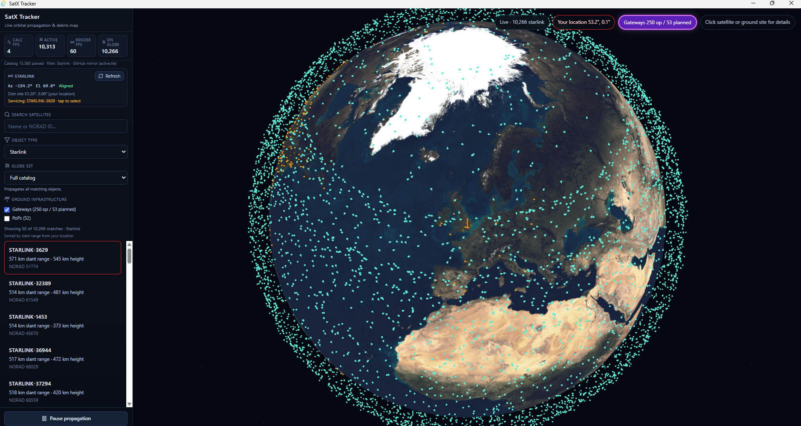

# SatX Tracker

[](https://github.com/bbuckle1959/SatX/releases)
[](https://tauri.app/)
[](https://github.com/bbuckle1959/SatX/releases)

**See what’s orbiting Earth — live on your desktop.** Track satellites and debris on a 3D globe, filter by type, find what’s nearest to you, and (on Starlink Wi‑Fi) see which satellite your dish is likely using.

Built with **Tauri 2**, React, TypeScript, Three.js, and `satellite.js`.



## Download

**[Latest release](https://github.com/bbuckle1959/SatX/releases)** — pick the installer for your system.

| Platform | Install |
|----------|---------|
| **Windows** | `SatX-*-Windows-x64.zip` — extract, then run the `.msi` (or `-Setup.exe`) inside |
| **macOS** | `SatX-*-macOS.zip` — extract, open the `.dmg`, drag the app to Applications |
| **Linux** | `SatX-*-Linux-x64.tar.gz` — extract, install the `.deb` or run the AppImage |

Each archive includes **README.md**, **LICENSE**, **ACKNOWLEDGMENTS.md**, and the **docs/** folder. See the release notes table on [Releases](https://github.com/bbuckle1959/SatX/releases). [Layout tips](docs/running/github-releases.md).

New to SatX? Start with the **[User guide](docs/user-guide.md)**. Developers: [build from source](docs/running/README.md).

## Documentation

| Guide | Who it is for |
|-------|----------------|
| **[User guide](docs/user-guide.md)** | Everyday users — how to use the app step by step |
| **[Application overview](docs/application-overview.md)** | What SatX does: globe, filters, tracking, Starlink, limits |
| **[Running & building](docs/running/README.md)** | Install, develop, and release builds per OS |
| **[All docs](docs/README.md)** | Index |
| **[Acknowledgments](ACKNOWLEDGMENTS.md)** | Libraries and data providers |

## What SatX does (summary)

- Loads a public catalog of active satellite orbits and **updates positions in real time** on a 3D Earth view.
- **Left sidebar** for filters, search, and the nearest list; **details** for the selected satellite or ground site appear in a panel **over the globe** (upper-left).
- Shows a **red marker** at your location (when you allow it) and lists the **50 closest** objects by distance.
- **Filter** by object type (stations, Starlink, navigation, debris, weather, and more), **search** by name or id, and open **details** by clicking the globe or list.
- **Globe set:** **Optimized** (up to 16,000 objects, default) or **Full catalog** (every object matching the filter; heavier).
- **Starlink** (desktop app, on dish Wi‑Fi): fetch dish pointing, match a **servicing** satellite (≥25° above your horizon), and draw an **orange link** from you to that satellite.
- **Starlink ground map** (Starlink filter): optional **gateway** and **PoP** markers on the globe from a bundled public dataset; click a site for details.

Details: **[Application overview](docs/application-overview.md)** · How to use it: **[User guide](docs/user-guide.md)**

## Platform support

| Supported | Not supported yet |
|-----------|-------------------|
| Windows, macOS, Linux desktop | iOS / Android apps |
| Installed SatX app | Starlink fetch in browser-only dev |
| | Phone/tablet as primary UI (`MOBILE_UI_ENABLED` is off) |

Tauri **2.x only** (`npm run ensure:tauri2`). Experimental Android/iOS scaffolding may exist in the repo but is not a supported product path.

## Running the app

| Guide | Platform |
|-------|----------|
| [Windows](docs/running/windows.md) | Windows 10/11 |
| [macOS](docs/running/macos.md) | macOS 10.15+ |
| [Linux](docs/running/linux.md) | Debian, Ubuntu, Fedora, Arch, … |
| [Release builds](docs/running/release-builds.md) | Installers + [GitHub Actions](.github/workflows/release.yml) on `v*` tags |

**Quick start (developers):** `npm install`, then:

| Platform | Development | Production build |
|----------|-------------|------------------|
| Windows | `npm run tauri:dev` | `npm run tauri:build` |
| macOS / Linux | `npm run tauri -- dev` | `npm run tauri -- build` |

Prerequisites: [Node.js](https://nodejs.org/) LTS, [Rust](https://www.rust-lang.org/tools/install), [Tauri 2 system deps](https://v2.tauri.app/start/prerequisites/).

## Browser-only dev (developers)

```bash
npm run dev
```

UI at `http://localhost:1420` without Tauri. Starlink dish fetch and some native features are unavailable. See [Application overview](docs/application-overview.md).

## npm scripts

| Script | Purpose |
|--------|---------|
| `npm run tauri:dev` | Desktop dev (Windows; uses `scripts/tauri-dev.cmd`) |
| `npm run tauri:build` | Desktop release build (Windows) |
| `npm run tauri -- dev` / `build` | macOS / Linux |
| `npm run dev` | Vite only (browser) |
| `npm run ensure:tauri2` | Verify Tauri 2.x pins |
| `npm run sync:ground-stations` | Refresh bundled Starlink gateway/PoP JSON from Hugging Face |

## Project layout (developers)

| Path | Role |
|------|------|
| `src/` | React UI, globe, hooks, workers |
| `src/data/ground-stations.json` | Bundled Starlink gateways & PoPs |
| `src/lib/globeCatalog.ts` | Filters, globe cap vs full catalog |
| `src-tauri/` | Rust: TLE catalog, Starlink HTTP |
| `docs/` | User guide, application overview, running guides |
| `.github/workflows/release.yml` | Multi-OS release builds on tag push |

## Acknowledgments

Thank you to the open-source projects and public data providers that make SatX possible. Full credits: **[ACKNOWLEDGMENTS.md](ACKNOWLEDGMENTS.md)**.
